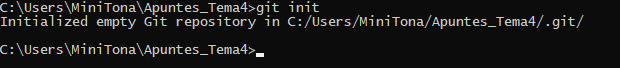
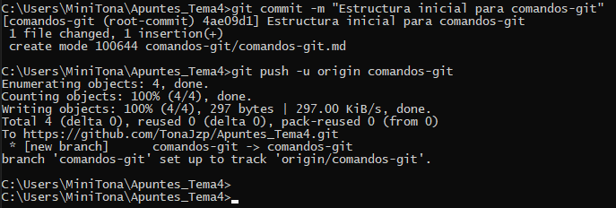
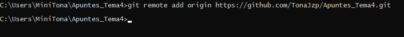
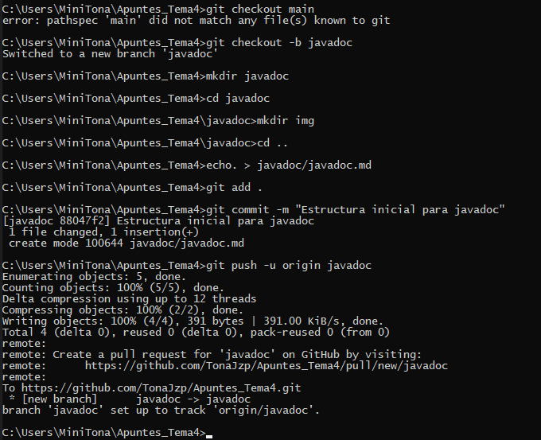

# 🧠 Apuntes sobre Git - Control de versiones

Git es un sistema de control de versiones distribuido muy usado en el desarrollo de software moderno. Permite llevar un historial detallado de los cambios en el código fuente, facilita el trabajo en equipo y permite el uso de ramas para desarrollar nuevas funcionalidades sin afectar la versión principal del proyecto.

---

## 📌 ¿Qué es un sistema de control de versiones?

Un sistema de control de versiones permite:
- Guardar versiones sucesivas del código.
- Comparar cambios entre versiones.
- Volver a estados anteriores si se introduce un error.
- Trabajar en paralelo en diferentes funcionalidades con ramas.

> Git fue creado por Linus Torvalds en 2005, el creador de Linux.

---

## 🧱 Comandos fundamentales

| Comando | Uso común | Ejemplo |
|--------|------------|---------|
| `git init` | Inicia un repositorio Git local | `git init` |
| `git clone` | Clona un repositorio remoto | `git clone https://github.com/usuario/repo.git` |
| `git status` | Muestra los cambios pendientes | `git status` |
| `git add` | Añade archivos al área de preparación (staging) | `git add .` |
| `git commit` | Guarda los cambios localmente | `git commit -m "mensaje"` |
| `git log` | Muestra el historial de commits | `git log` |
| `git branch` | Muestra o crea ramas | `git branch nueva-rama` |
| `git checkout` | Cambia entre ramas | `git checkout main` |
| `git merge` | Fusiona ramas | `git merge rama-secundaria` |
| `git push` | Sube cambios al remoto | `git push origin main` |
| `git pull` | Descarga y fusiona cambios del remoto | `git pull` |

---

## 🔄 Flujo de trabajo básico

```bash
git init
git add .
git commit -m "Primer commit"
git branch -M main
git remote add origin https://github.com/usuario/repositorio.git
git push -u origin main
```

---

## 🌿 Trabajo con ramas

El uso de ramas es esencial en Git. Permite crear versiones independientes del proyecto, probar nuevas funciones o escribir documentación sin interferir con el trabajo principal.

### 🔸 Crear y cambiar a una rama
```bash
git checkout -b comandos-git
```

### 🔸 Ver las ramas existentes
```bash
git branch
```

### 🔸 Cambiar a otra rama
```bash
git checkout main
```

### 🔸 Fusionar una rama a main
```bash
git merge comandos-git
```

Aquí puedes ver un ejemplo del comando `git merge` fusionando la rama `comandos-git` con `main`:


---

## 🧪 Control de versiones con Git

Los sistemas como Git permiten:
- Mantener un historial completo del proyecto.
- Retroceder a cualquier punto anterior.
- Colaborar sin sobrescribir archivos ajenos.
- Ramificar y experimentar sin riesgo.

En la siguiente imagen, se muestra el resultado de ejecutar `git status`, donde se visualizan los archivos sin seguimiento:



En la siguiente imagen, se muestra el resultado de ejecutar `git add`, donde se preparan los cambios para el commit:



---

## ✅ Ejercicio propuesto

1. Inicializa un nuevo repositorio en una carpeta vacía.
2. Crea un archivo `notas.txt`, añade contenido y haz commit.
3. Crea una rama `experimento`, modifica el archivo y haz commit.
4. Vuelve a `main` y fusiónala.
5. Verifica el historial con `git log`.

Aquí se muestra el comando `git log` mostrando el historial de commits con hash, autor y mensaje:



Aquí se muestra el resultado de un `git push`, demostrando cómo se suben los cambios al repositorio remoto:



---

## 📦 Archivos comunes en un proyecto con Git

### `.gitignore`
Lista de archivos o carpetas que no deben incluirse en el repositorio.

Ejemplo:
```
*.class
.idea/
target/
.DS_Store
```

---

## 📚 Recursos útiles

- [Pro Git Book (en español)](https://git-scm.com/book/es/v2)
- [Guía oficial de GitHub](https://docs.github.com/es/get-started)
- [Git Cheatsheet PDF (GitHub)](https://training.github.com/downloads/es_ES/github-git-cheat-sheet.pdf)

---

## 🧠 Buenas prácticas

- Realiza commits frecuentes y con mensajes claros.
- Usa ramas para cada funcionalidad o apartado de trabajo.
- No modifiques directamente `main` sin probar en ramas.
- Comenta tus cambios si colaboras en equipo.

---

**Autor:** Tona Jzp  
**Proyecto:** Apuntes de Git, Javadoc y Optimización  
